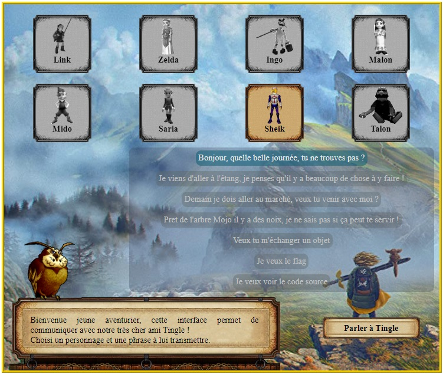

# CTF Web Serveur - Conversation serialisée

## Présentation du CTF 
**ID** 16 dans **les CTFs de Cyrhades**

Récupérez le flag en exploitant la désérialisation d'un objet.

Vous pouvez dans ce challenge demander à Tingle le code source, cela vous permettra de comprendre comment exploiter cette conversation serializée.

## Aperçu

-----------

## Installation manuel
Vous n'utilisez pas l'application **les CTFs de Cyrhades** ? C'est dommage !
Mais voici comment installer ce CTF manuellement :

> git clone https://github.com/Hack-Oeil/UNSERIALIZE_CONVERSATION.git

> cd UNSERIALIZE_CONVERSATION && docker compose up

